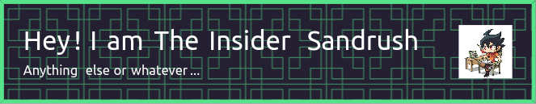

### Hi there 👋

 

- 🔭 I’m currently working on my own Minecraft mod, HTML webpage (and more) for fun
- 🌱 I’m currently learning HTML basics, Java, C# and C++.
- 👯 I’m looking to collaborate on someone that has more experience than me.
- 🤔 I’m looking for help.
- 💬 Ask me about: h
- 📫 How to reach me: On [Twitter](https://twitter.com/InsiderSandrush?mx=1) (not "X"), [Bluesky](https://bsky.app/profile/did:plc:zdtbxbe2lvxc3aiyplqivtyd) and [Mastodon](https://mastodon.social/@theinsidersandrush@pawoo.net)
- 😄 Pronouns: He/Him, They/Them
- ⚡ Fact:
  - never used AI (generative video, audio, texts, speech and images) because [Thomas Bangalter told me I shouldn't](https://www.bbc.com/news/entertainment-arts-65140938).
  - also dope on the mic
- 📺📻 I'm also an archivist on television and radio, [Astro Malaysia](https://astro.com.my) to be in particular (not too much).

__Want to know more about me? Check out [here](https://web.archive.org/web/20000301045908/http://x.com/).__

__Read the old README [here](OLDREADME.md) if you want it.__

[Artwork by Hamonika Monika (linked to third-party site)](https://danbooru.donmai.us/posts/6682205)

